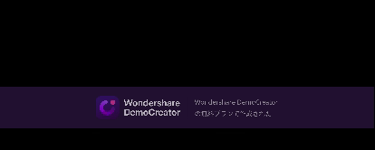

# chordis
MIDIキーボードから入力された和音をディスプレイ左上に表示するアプリケーションです。

## Demo


## 機能
- MIDIキーボードから入力された和音名をリアルタイムに表示します。
- 和音名は英語表記で表示されます。

## インストール
- [ここ](https://github.com/shuntacurosu/chordis/releases)から最新バージョンのchordis.zipをダウンロードしてください。
- ダウンロードしたzipファイルを解凍してください。
- 解凍したフォルダ内にあるchordis.batを実行するとアプリケーションが起動します。

## 使い方
- MIDIキーボードをPCに接続します。
- chordis.batを実行します。タスクトレイにアイコンが表示されます。
- MIDIキーボードで和音を弾きます。ディスプレイ左上に和音名が表示されます。
- 終了するときはタスクトレイのアイコンを右クリックし、「quit」を選択します。

## 開発
### 開発環境
```
$ python --version
Python 3.10.10

$ pip install -U pip
$ pip install -r requirements.txt
```

### 再配布用zipファイル作成
- make.pyを実行します。
    ```
    $ python make.py
    ```
- make.pyでは以下の処理が行われます。
    1. 作業ディレクトリ直下(ここではchordis_pj)にchordisを作成します。
    1. chordis_pj/chordis/envフォルダにPython Embeddable環境を作成します。
    1. chordis_pj/chordis/envフォルダにmainブランチをpullします。
    1. chordis_pj/chordis/chordis.bat(実行用bat)を配置します。
    1. chordis_pj/requirements.txtを読み込み、chordis_pj/chordisに必要なライブラリをインストールします。
    1. chordis_pj/chordis/__pycache__を削除します。
    1. chordis_pj/chordis/.gitを削除します(Y/N選択有り)
- make.pyを再度実行する場合、作成されたchordisフォルダとchordis.zipは削除してください。
## ライセンス
このプロジェクトはGNU General Public License v3.0のもとで公開されています。詳細は[LICENSE](https://github.com/shuntacurosu/chordis/blob/main/LICENSE)を参照してください
