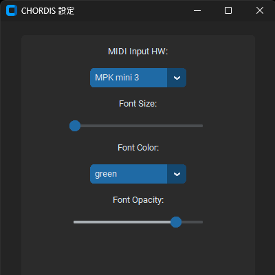

# chordis
MIDIキーボードから入力された和音をディスプレイ左上に表示するアプリケーションです。

## デモ


## 機能
- MIDIキーボードから入力された和音名を英語表記で表示します。

## インストール
- 最新バージョンのchordis.zipを[ここ](https://github.com/shuntacurosu/chordis/releases)からダウンロードしてください。
- ダウンロードしたzipファイルを解凍してください。
- 解凍したフォルダ内のchordis.batを実行するとアプリケーションが起動します。

## 使い方
### 基本操作
- MIDIキーボードをPCに接続します。
- chordis.batを実行します。タスクトレイにアイコンが表示されます。
- MIDIキーボードで和音を演奏します。ディスプレイ左上に和音名が表示されます。
- 終了するときはタスクトレイのアイコンを右クリックし、「quit」を選択します。

### 設定
- タスクトレイのアイコンを右クリックし、「config」を選択します。設定画面が表示されます。
- 設定画面では以下の項目が変更可能です。
    | 設定値 | 説明 |
    | ---- | ---- |
    | MIDI Input HW | MIDI入力機器(Default:不定)
    | Font Size | フォントの倍率(Default:1.0)
    | Font Clolor | フォントの色(Default:green)
    | Font Opacity | フォントの不透明度(Default:0.8)

    
## 開発
### 開発環境
- Python 3.10.10
- requirements.txtでライブラリをインストールしてください。
    ```
    $ pip install -U pip
    $ pip install -r requirements.txt
    ```

### 再配布用zipファイル作成
- make.pyを実行してください。
    ```
    $ python make.py
    ```
- make.pyでは以下の処理が行われます。
    1. 作業ディレクトリ直下(chordis_pj)にchordisフォルダを作成します。
    1. chordis_pj/chordis/envフォルダにPython Embeddable環境を作成します。
    1. mainブランチをchordis_pj/chordis/envフォルダにpullします。
    1. chordis_pj/chordis/chordis.bat(実行用bat)を配置します。
    1. chordis_pj/requirements.txtを読み込み、chordis_pj/chordisに必要なライブラリをインストールします。
    1. chordis_pj/chordis/__pycache__を削除します。
    1. chordis_pj/chordis/.gitを削除します(Y/N選択有り)
- make.pyを再度実行する場合、作成されたchordisフォルダとchordis.zipは削除してください。

## ライセンス
このプロジェクトはGNU General Public License v3.0のもとで公開されています。詳細は[LICENSE](https://github.com/shuntacurosu/chordis/blob/main/LICENSE)を参照してください
